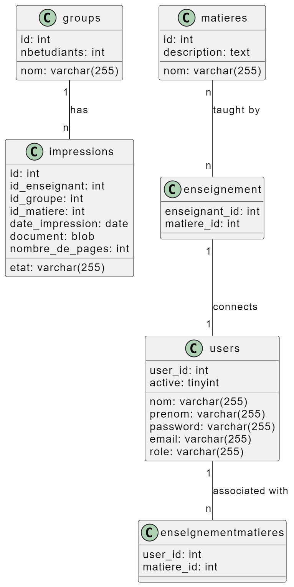

# University Printer Management System

## Project Objective

- **Facilitate print requests for teachers**: Provide a user-friendly interface for easily submitting print requests, specifying details such as the document, subject, and number of copies.
- **Optimize the printing service operations**: Provide a clear dashboard for print agents to efficiently manage requests and plan tasks.
- **Ensure efficient user management**: Provide administrators with tools to manage accounts, enable or disable access, and ensure platform security.

## Description

Develop a web-based print management platform for an academic institution. This platform will be used by three types of users: print agents, teachers, and administrators.

## Features

### For Teachers:
- Intuitive interface for submitting print requests.
- Access to taught subjects after login.
- Selection of subject, PDF document upload, specification of the date and time for print service arrival, and indication of the number of copies to be printed.
- Limitation of the number of copies to the number of students in the group.

### For Print Agents:
- Access to a dashboard detailing the day's tasks after login.
- Table containing the teacher's name, the number of copies to print, the request reception date, and the document to be printed.
- Efficient planning and execution of print tasks.

### For Administrators:
- User account management.
- Creation, activation, and deactivation of accounts.
- Guarantee of platform security and proper functioning.

## Technologies Used

The platform will be developed using JavaEE web components, including:
- JSP
- Servlet
- JSTL
- EL

These technologies ensure a robust and high-performance application.

## Installation

1. Clone the repository:
   ```sh
   git clone https://github.com/DERBALIKhayreddine/UniversityPrinterManagment

-----------------------------
# Système de Gestion d'Imprimantes Universitaires

## Objectif du Projet

- **Faciliter les demandes d'impression pour les enseignants** : Offrir une interface conviviale pour soumettre facilement des demandes d'impression, en précisant les détails comme le document, la matière et le nombre de copies.
- **Optimiser les opérations du service d'impression** : Fournir un tableau de bord clair pour que les agents de tirage puissent gérer efficacement les demandes et planifier les tâches.
- **Assurer une gestion efficace des utilisateurs** : Offrir à l'administrateur les outils pour gérer les comptes, activer ou désactiver les accès et garantir la sécurité de la plateforme.

## Description

Développer une plateforme de gestion d'impression pour une institution académique, basée sur une approche Web. Cette plateforme sera utilisée par trois types d'utilisateurs : les agents de tirage, les enseignants, et les administrateurs.

## Fonctionnalités

### Pour les Enseignants :
- Interface intuitive pour soumettre des demandes d'impression.
- Accès aux matières enseignées après connexion.
- Choix de la matière, téléversement du document au format PDF, spécification de la date et de l'heure d'arrivée au service de tirage, et indication du nombre de copies à imprimer.
- Limitation du nombre de copies au nombre d'étudiants du groupe.

### Pour les Agents de Tirage :
- Accès à un tableau de bord détaillant les tâches de la journée après connexion.
- Tableau contenant le nom de l'enseignant, le nombre de copies à imprimer, la date de réception de la demande, et le document à imprimer.
- Planification et exécution efficaces des tâches d'impression.

### Pour les Administrateurs :
- Gestion des comptes des utilisateurs.
- Création, activation et désactivation des comptes.
- Garantie de la sécurité et du bon fonctionnement de la plateforme.

## Technologies Utilisées

La plateforme sera développée en utilisant les composants Web de JavaEE, notamment :
- JSP
- Servlet
- JSTL
- EL

Ces technologies garantissent une application robuste et performante.

## Installation

1. Clonez le repository :
   ```sh
   git clone https://github.com/DERBALIKhayreddine/UniversityPrinterManagment

## Interfaces
#### Diagrammes de Classes / Class Diagrams:

#### Page d'Accueil / Home Page:

#### Page de Connexion / Login Page:

#### Tableau de Bord Administrateur / Admin Dashboard Page:

#### Tableau de Bord Enseignant / Teacher Dashboard Page:

#### Tableau de Bord Agent d'Impression / Print Agent Dashboard Page:


SQl :
```sh
CREATE DATABASE gestion_impression;
USE gestion_impression;

-- Table: users
CREATE TABLE users (
    user_id INT AUTO_INCREMENT PRIMARY KEY,
    nom VARCHAR(255) NOT NULL,
    prenom VARCHAR(255) NOT NULL,
    password VARCHAR(255) NOT NULL,
    email VARCHAR(255) NOT NULL UNIQUE,
    role VARCHAR(255) NOT NULL,
    active BOOLEAN NOT NULL
);

-- Table: roles
CREATE TABLE roles (
    id INT AUTO_INCREMENT PRIMARY KEY,
    name VARCHAR(255) NOT NULL UNIQUE
);

-- Table: matieres
CREATE TABLE matieres (
    id INT AUTO_INCREMENT PRIMARY KEY,
    nom VARCHAR(255) NOT NULL,
    description TEXT
);

-- Table: groups
CREATE TABLE groups (
    id INT AUTO_INCREMENT PRIMARY KEY,
    nom VARCHAR(255) NOT NULL,
    nbetudiants INT NOT NULL
);

-- Table: enseignement
CREATE TABLE enseignement (
    enseignant_id INT NOT NULL,
    matiere_id INT NOT NULL,
    PRIMARY KEY (enseignant_id, matiere_id),
    FOREIGN KEY (enseignant_id) REFERENCES users(user_id),
    FOREIGN KEY (matiere_id) REFERENCES matieres(id)
);

-- Table: enseignementMatieres
CREATE TABLE enseignementMatieres (
    user_id INT NOT NULL,
    matiere_id INT NOT NULL,
    PRIMARY KEY (user_id, matiere_id),
    FOREIGN KEY (user_id) REFERENCES users(user_id),
    FOREIGN KEY (matiere_id) REFERENCES matieres(id)
);

-- Table: impressions
CREATE TABLE impressions (
    id INT AUTO_INCREMENT PRIMARY KEY,
    id_enseignant INT NOT NULL,
    id_groupe INT NOT NULL,
    id_matiere INT NOT NULL,
    date_impression DATE NOT NULL,
    document BLOB,
    etat VARCHAR(255) NOT NULL,
    nombre_de_pages INT NOT NULL,
    FOREIGN KEY (id_enseignant) REFERENCES users(user_id),
    FOREIGN KEY (id_groupe) REFERENCES groups(id),
    FOREIGN KEY (id_matiere) REFERENCES matieres(id)
);

-- Sample INSERT commands for roles
INSERT INTO roles (name) VALUES ('admin');
INSERT INTO roles (name) VALUES ('teacher');
INSERT INTO roles (name) VALUES ('student');


